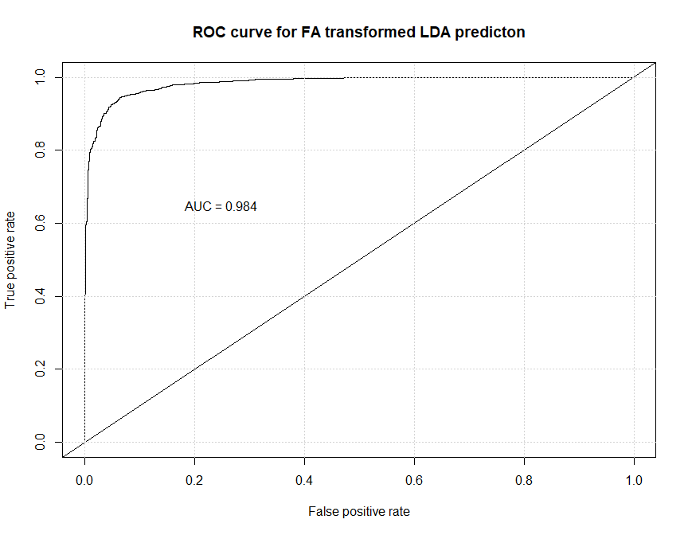

***
# Introduction
The goal of this document is to show how LDA can be used to classify FIFA 22 player's positions.
FIFA 22 is a popular football simulator. This game is enjoyed by milions of people and player's abilities in the simulator are documented pretty accurately.  


We reduce the classification with LDA technique only to a binary classification because it is easier for illustration and easier to interpret. Additionally we use two different approaches:

1. We transform the data with Factor Analysis and then use LDA for classification
2. We only standardize the data and then run LDA

After this we compare models with multiples techniques to show which performs better.


# 1. Data exploration and dimensionality reduction
## 1.1. Data loading and preprocessing

Clear workspace and load libraries


**Data Source:**  [link](www.kaggle.com/bryanb/fifa-player-stats-database/version/27?select=FIFA22_official_data.csv)

```r
# Import data
raw_data <- read_delim("FIFA22_official_data.csv")
```
How many unique roles/positions are in the dataset?

```
## [1] 15
```
***
**Preprocess the data**


* we have 15 unique positions - We'd like to make that number smaller becuase many positions are very similar
* We can divide them into following categories:
    * Center Forward
    * Center Midfielder
    * Right Midfielder/Winger
    * Left Midfielder/Winger
    * Right Back
    * Left Back
    * Central Back (defender)
    * Goalkeeper


```r
data <- raw_data %>%
    # Reduction of positions
    dplyr::mutate(
        BestPos = factor(
            case_when(
                `Best Position` %in% c("CF", "ST") ~ "CF/ST",
                `Best Position`  %in% c("CAM", "CM", "CDM") ~ "CM/CAM/CDM",
                `Best Position` %in% c("RW", "RM") ~ "RW/RM",
                `Best Position` %in% c("LW", "LM") ~ "LW/RM",
                `Best Position` %in% c("RWB", "RB") ~ "RWB/RB",
                `Best Position` %in% c("LWB", "LB") ~ "LWB/LB",
                `Best Position` %in% c("CB") ~ "CB",
                `Best Position` %in% c("GK") ~ "GK"
            )
        ),
        Height = as.double(str_replace(Height, 'cm', '')),
        Weight = as.double(str_replace(Weight, 'kg', '')),
        PrefFoot = as.factor(`Preferred Foot`),
        WeekFoot = `Weak Foot`,
        SkillMoves = `Skill Moves`,
        WorkRate = as.factor(`Work Rate`),
        BodyType = factor(`Body Type`)
    ) %>%
    # Picking only relevant columns
    dplyr::select(
        Name,
        BestPos,
        Age,
        PrefFoot,
        WeekFoot,
        SkillMoves,
        WorkRate,
        BodyType,
        Height,
        Weight,
        Crossing,
        Finishing,
        HeadingAccuracy,
        ShortPassing,
        Volleys,
        Dribbling,
        Curve,
        FKAccuracy,
        LongPassing,
        BallControl,
        Acceleration,
        SprintSpeed,
        Agility,
        Reactions,
        Stamina,
        Interceptions,
        Balance,
        Strength,
        Positioning,
        ShotPower,
        LongShots,
        Vision,
        StandingTackle,
        Jumping,
        Aggression,
        Penalties,
        SlidingTackle
    ) 
```


**Choice of 2 positions to predict:**


* To make the prediction even simpler, we will predict only Centre Forwards and Central Midfielders
    * These two categories should be quite different and we expect LDA to perform well
* To make the prediction simpler, we use only numeric variables, thus we exclude categorical columns


```r
fifa <- data %>%
    filter(BestPos %in% c("CM/CAM/CDM", "CF/ST")) %>%
    # Ponechame si vsak iba numericke stlpce
    select_if(!(map(., class) %in% c("factor", "character")))

# Number of NA values
str_glue('{round(sum(is.na(fifa)) / dim(fifa)[1] * 100, 2)} %')
```

```
## 2.93 %
```


Only 3% of rows contain missing values - we can drop those


***

## 1.2. PCA
In next step, we perform PCA to see whether it can, keep substantional amount of variance in first three Principal Components. The number 3 comes from the knowledge of the columns. They could be roughly divided into 3 categories: Offensive, Defensive and Physical attributes.


```r
# Fit PCA on standardized and centered data
fit <- prcomp(fifa, center = T, scale. = T)
# Show results
sum_pca <- summary(fit) 
sum_pca
```

```
## Importance of components:
##                           PC1    PC2    PC3     PC4     PC5     PC6     PC7
## Standard deviation     3.2114 2.3791 2.1818 1.49468 1.09013 0.94982 0.85284
## Proportion of Variance 0.3223 0.1769 0.1488 0.06982 0.03714 0.02819 0.02273
## Cumulative Proportion  0.3223 0.4992 0.6479 0.71773 0.75487 0.78306 0.80579
##                            PC8     PC9    PC10    PC11    PC12    PC13    PC14
## Standard deviation     0.77856 0.72361 0.69902 0.64652 0.63006 0.58375 0.57218
## Proportion of Variance 0.01894 0.01636 0.01527 0.01306 0.01241 0.01065 0.01023
## Cumulative Proportion  0.82474 0.84110 0.85637 0.86943 0.88184 0.89248 0.90272
##                           PC15    PC16    PC17    PC18    PC19    PC20    PC21
## Standard deviation     0.54945 0.53306 0.51456 0.49619 0.47960 0.45674 0.45173
## Proportion of Variance 0.00943 0.00888 0.00827 0.00769 0.00719 0.00652 0.00638
## Cumulative Proportion  0.91215 0.92103 0.92930 0.93700 0.94419 0.95070 0.95708
##                           PC22    PC23    PC24    PC25   PC26    PC27    PC28
## Standard deviation     0.43188 0.42434 0.42088 0.40959 0.3754 0.34597 0.33975
## Proportion of Variance 0.00583 0.00563 0.00554 0.00524 0.0044 0.00374 0.00361
## Cumulative Proportion  0.96291 0.96854 0.97407 0.97932 0.9837 0.98746 0.99107
##                           PC29    PC30    PC31    PC32
## Standard deviation     0.30633 0.28678 0.27509 0.18461
## Proportion of Variance 0.00293 0.00257 0.00236 0.00107
## Cumulative Proportion  0.99400 0.99657 0.99893 1.00000
```

If we were to reduce the dimensionality, we would be probably satisfied with 75% variance retained (5 PCs).
But let's make a **Scree Plot**

<!-- -->


* Biplot isn't very helpful in this case

<!-- -->

***
## 1.3 FA
Next we perform Factor Analysis. We know approximately how much factors we should have and we can represent players/positions with smaller number of columns. Even EA Sports (FIFA 22 producers) summarizes the different players with fewer attributes. They show you their radar plots in the game. It can be useful to determine which player to play at the positions, as there are more options usually.
We wanna reduce the number of dimensions only to k=3 because we don't need more and assume no or only small lost of information.  
We can see in the diagram that FA dimension reduction produces what we'd expect. We can name the dimensions (approximately) as following:


* Offensive abilities (ML2)
* Defensive abilities (ML1)
* Physical attributes (ML3)

In the diagram below, we can see that the attributes fit into the categories as we'd expect.  

<!-- -->


Below, we can see absolute values of loadings

<!-- -->


In the **scatter matrix** we can see that the variables are approximately well divided into 3 clusters. Yes they overlap sometimes, but not substantionally. 

<!-- -->

In the resulting residual matrix, we see that the non-diagonal values are close to zero.


```
##                  SprintSpeed       Agility    Reactions      Stamina
## Age             -0.238910901 -0.0312861424  0.013010434 -0.091907427
## WeekFoot        -0.013263106  0.0006404387 -0.015558759 -0.002736389
## SkillMoves       0.025734400  0.0332461198 -0.027875443 -0.030345344
## Height           0.052532028 -0.0266354129 -0.035215759 -0.015163866
## Weight           0.030024445  0.0037655906 -0.039492595 -0.021855924
## Crossing        -0.048793175 -0.0252128221 -0.066625546 -0.070328810
## Finishing        0.057317422  0.0264080834  0.003776993  0.042579277
## HeadingAccuracy  0.075130188  0.0378744392  0.067241020  0.051849723
## ShortPassing    -0.055711107 -0.0535017698  0.029637041 -0.029952258
## Volleys         -0.038827569  0.0009842898 -0.025381472 -0.065620693
## Dribbling        0.102397760  0.0312432489  0.009916642  0.014802503
## Curve           -0.108844997 -0.0333932393 -0.074138220 -0.105821457
## FKAccuracy      -0.166504120 -0.0823922959 -0.091815221 -0.127489387
## LongPassing     -0.077955221 -0.0624064905 -0.026743633 -0.048344101
## BallControl     -0.009421252 -0.0145082407  0.035864507 -0.012596562
## Acceleration     0.586934123  0.2881958106  0.048403989  0.306363436
##                 Interceptions     Balance      Strength   Positioning
## Age              0.0374101727  0.05346597  0.0055072082  0.0020238102
## WeekFoot         0.0047144176  0.01237015  0.0003327149 -0.0164435783
## SkillMoves      -0.0053750607 -0.02923123  0.0213794113 -0.0217290277
## Height          -0.0130280826 -0.16474966  0.0227440113 -0.0307214646
## Weight          -0.0128632657 -0.03917749  0.0770199750 -0.0377041666
## Crossing        -0.0014611167 -0.03393098 -0.0010206557 -0.0410212124
## Finishing       -0.0042019514  0.02249064 -0.0137386287  0.0861177303
## HeadingAccuracy  0.0026188810  0.04830608  0.0157485297  0.0327282801
## ShortPassing    -0.0094410483 -0.03887851 -0.0059115301 -0.0156496767
## Volleys         -0.0010636622  0.02428239 -0.0405146012  0.0087122428
## Dribbling       -0.0171284307 -0.02970264  0.0192556557  0.0004354366
## Curve           -0.0001469623 -0.02998515 -0.0308287124 -0.0499154467
## FKAccuracy       0.0007284330 -0.03759678 -0.0409780131 -0.0618377678
## LongPassing     -0.0043443673 -0.04954558 -0.0049293897 -0.0409681486
## BallControl     -0.0092081646 -0.02664976  0.0081881022 -0.0086751575
## Acceleration     0.0034175023  0.09371438  0.1176177545  0.0401760659
##                    ShotPower    LongShots       Vision StandingTackle
## Age             -0.010104432  0.008752249  0.024550154  -0.0149061860
## WeekFoot        -0.008534781  0.001946412  0.001302327   0.0008977239
## SkillMoves      -0.023869361 -0.018061721  0.003985273   0.0030257933
## Height          -0.046878773 -0.029009889  0.037410489  -0.0022800475
## Weight          -0.010020256 -0.013504660  0.017802202  -0.0059081535
## Crossing         0.010820450  0.009272476  0.039201069  -0.0085222405
## Finishing        0.017545489  0.063619049 -0.026161688   0.0180258859
## HeadingAccuracy  0.012686341 -0.039229824 -0.049953690   0.0030950130
## ShortPassing    -0.035075579 -0.041667270  0.046521284  -0.0125102031
## Volleys          0.046726426  0.024001668 -0.027133330   0.0085572060
## Dribbling       -0.016815039 -0.031853187 -0.007708517   0.0024495765
## Curve            0.025447173  0.029478227  0.022266658  -0.0038295295
## FKAccuracy       0.027684435  0.074050163  0.037884579  -0.0080550152
## LongPassing     -0.023273108 -0.004627874  0.061452492  -0.0155298398
## BallControl     -0.025080917 -0.046333705  0.007814913  -0.0041633018
## Acceleration     0.045574060 -0.003809894 -0.091129027   0.0187447748
##                      Jumping   Aggression   Penalties
## Age              0.044143165  0.071552150  0.11767721
## WeekFoot         0.024858446  0.003050189  0.01458838
## SkillMoves      -0.033061538  0.001807417 -0.02619248
## Height          -0.115725609 -0.090528594 -0.06676369
## Weight          -0.054309728 -0.031059571 -0.04889440
## Crossing        -0.058191310 -0.019610985  0.02530893
## Finishing        0.017163775 -0.014549525  0.02819225
## HeadingAccuracy  0.214916253  0.059219235  0.04307919
## ShortPassing    -0.045959156 -0.032419888 -0.02843555
## Volleys          0.006308235  0.012768084  0.07263116
## Dribbling       -0.015199436 -0.017386667 -0.06222021
## Curve           -0.079811702 -0.022773324  0.06087840
## FKAccuracy      -0.112788957 -0.040108676  0.11046965
## LongPassing     -0.067054362 -0.039994511 -0.01473764
## BallControl     -0.028736085 -0.022418541 -0.04267697
## Acceleration     0.224504446  0.082760575 -0.08540515
```

**Obervations represented in the new (tranformed) system.**


From our knowledge we can be pretty confident in the results. When we compare Bruno Fernandes and J.Kimmich we can see that the values correspond to what we'd expect. The first one is offensive player who scores goals, assits and could be labelled as attacking playmaker who creates a lot of chanes. The latter is more defensive player. He scores higher in defense and lower in offensive abilities. They share similar physicality, which is again accurately displayed in the new system. 

<div class="kable-table">

|Name            |Pos        |      Off|       Def|       Phys|
|:---------------|:----------|--------:|---------:|----------:|
|Bruno Fernandes |CM/CAM/CDM | 2.817206| 1.3764265| -0.2314784|
|L. Goretzka     |CM/CAM/CDM | 2.045477| 2.0199530|  1.0786675|
|L. Suárez       |CF/ST      | 3.017605| 0.1388599|  0.9096749|
|K. De Bruyne    |CM/CAM/CDM | 3.170166| 1.0938722| -0.3884154|
|J. Kimmich      |CM/CAM/CDM | 1.799305| 2.0768607| -0.2914197|
|Paulinho        |CM/CAM/CDM | 1.855980| 1.7048592|  0.8479147|

</div>

We can visualize aggregated comparison of values for both positions. We use median because the average can be inflated by few players who have high overall ratings.  


Reminder:  


* "CF/ST" - Attacker, Central forward, Striker  
* "CM/CAM/CDM" - Central Attacking/Defensive (or hybrid) Midfielder  

Again, the plot is meaningful. Midflieders score reasonably higher than attackers. On the contrary, attackers tend to be "tougher" as they "fight" with very strong and high defenders. Midfielders are less strong but are more agile and have better stamina. They can cover bigger area and thus are better at defending.  

<!-- -->

***
# 2. LDA
## 2.1. LDA on FA transformed columns  

In the next step we will apply LDA on FA tranformed dataset.  


Data could look more normal, but it isn't bad either.  
The reason for the distribution in Def is that we have midfielders who are similar in this facotor to the attackers (score really low in defense). Than there are midfielders/attackers like Roberto Firmino, who have great defending as they're useful for quickly regaining control high up the pitch after loosing posession.

<!-- -->


**LDA on FA transformed data.**


```r
# Train-Test split
train.index.fa <-
    fifa.fa$Pos %>% createDataPartition(p = 0.75, list = FALSE)
train.data.fa <- fifa.fa[train.index.fa,]
test.data.fa <- fifa.fa[-train.index.fa,]

# Fitni model
model.fa <- lda(Pos ~ ., data = train.data.fa,)

# Predikcie
predictions.fa <- model.fa %>% predict(test.data.fa)

## Evaluation
# Mozeme vidiet, ze model je pomerne dobry v tom ako predikuje hodnoty!
predictions.posteriors.fa <-
    as.data.frame(predictions.fa$posterior[, 2])
pred.fa <-
    prediction(predictions.posteriors.fa, test.data.fa$Pos)
roc.perform.fa <-
    performance(pred.fa, measure = "tpr", x.measure = "fpr")
auc.train.fa <- performance(pred.fa, measure = "auc")
auc.train.fa.val <- auc.train.fa@y.values

AUC_FA <- as.double(auc.train.fa.val)
```


**ROC curve for FA - LDA**

<!-- -->

***
## 2.2. LDA on not-transformed columns  


```r
# Data
fifa.raw <-
    cbind(
        data %>%
            filter(BestPos %in% c("CM/CAM/CDM", "CF/ST")) %>%
            mutate(BestPos = factor(BestPos, levels = c(
                "CM/CAM/CDM", "CF/ST"
            )))
        %>% na.omit() %>% dplyr::select(BestPos),
        fifa
    )
# Preprocessing
preproces.param.raw <-
    fifa.raw %>% preProcess(method = c("center", "scale"))
fifa.raw.trans <- preproces.param.raw %>% predict(fifa.raw)

# Train-test split
train.index.raw <-
    fifa.raw$BestPos %>% createDataPartition(p = 0.75, list = FALSE)
train.data.raw <- fifa.raw.trans[train.index.raw,]
test.data.raw <- fifa.raw.trans[-train.index.raw,]

# Fit the model
model.raw <- lda(BestPos ~ ., data = train.data.raw)

# Predikcie
predictions.raw <- model.raw %>% predict(test.data.raw)

# Evaluation
predictions.posteriors.raw <-
    as.data.frame(predictions.raw$posterior[, 1])

pred.raw <-
    prediction(predictions.posteriors.raw, test.data.raw$BestPos)
roc.perform.raw <-
    performance(pred.raw, measure = "tpr", x.measure = "fpr")
auc.train.raw <- performance(pred.raw, measure = "auc")
auc.train.raw.val <- auc.train.raw@y.values
AUC_RAW <- as.double(auc.train.raw.val)
```

**ROC Curve for raw data LDA**

<!-- -->


**Visualization of model on new LDA transformed axis**


<!-- -->

**Confusion Matrix**


```r
confusion.mx <- confusionMatrix(
    data = as.factor(lda.raw.viz$Pred_class),
    reference = as.factor(lda.raw.viz$Act_class),
    dnn = c("Prediction", "Reference"),
)
confusion.mx
```

```
## Confusion Matrix and Statistics
## 
##             Reference
## Prediction   CF/ST CM/CAM/CDM
##   CF/ST        637         36
##   CM/CAM/CDM    15       1081
##                                           
##                Accuracy : 0.9712          
##                  95% CI : (0.9623, 0.9785)
##     No Information Rate : 0.6314          
##     P-Value [Acc > NIR] : < 2.2e-16       
##                                           
##                   Kappa : 0.9385          
##                                           
##  Mcnemar's Test P-Value : 0.005101        
##                                           
##             Sensitivity : 0.9770          
##             Specificity : 0.9678          
##          Pos Pred Value : 0.9465          
##          Neg Pred Value : 0.9863          
##              Prevalence : 0.3686          
##          Detection Rate : 0.3601          
##    Detection Prevalence : 0.3804          
##       Balanced Accuracy : 0.9724          
##                                           
##        'Positive' Class : CF/ST           
## 
```

***
# 3. Which method is better?

To this point, we produced two LDA classifications. One for FA transformed data and one for not transformed data. From results it seems that the latter performs better. But still, we should verify wheter it does.  

We will create 100 runs of both classifications, get AUC and compare these two with t-test.

## 3.1. FA transformed LDA classification - 100 runs


```r
# seed
set.seed(123)

AUC_FA <- rep(0, 100) # Empty vector for storing results of classification.
for (i in 1:100) {
    # Train-Test split
    train.index.fa <-
        fifa.fa$Pos %>% createDataPartition(p = 0.75, list = FALSE)
    train.data.fa <- fifa.fa[train.index.fa,]
    test.data.fa <- fifa.fa[-train.index.fa,]
    
    # Fit the model
    model.fa <- lda(Pos ~ ., data = train.data.fa,)
    
    # Predikcie
    predictions.fa <- model.fa %>% predict(test.data.fa)
    
    # Evaluation
    predictions.posteriors.fa <-
        as.data.frame(predictions.fa$posterior[, 2])

    pred.fa <-
        prediction(predictions.posteriors.fa, test.data.fa$Pos)
    roc.perform.fa <-
        performance(pred.fa, measure = "tpr", x.measure = "fpr")
    auc.train.fa <- performance(pred.fa, measure = "auc")
    auc.train.fa.val <- auc.train.fa@y.values
    
    # Save the results to vector of AUC values for FA transformed LDA
    AUC_FA[i] <- as.double(auc.train.fa.val)
}
```

***
## 3.2.Non-transformed LDA classification - 100 runs  
(it can take longer as there are more columns)

```r
AUC_RAW <- rep(0, 100) # Empty vector for storing results of classification.
for (i in 1:100) {
    # Preprocessing
    preproces.param.raw <-
        fifa.raw %>% preProcess(method = c("center", "scale"))
    fifa.raw.trans <- preproces.param.raw %>% predict(fifa.raw)
    
    # Train-test split
    train.index.raw <-
        fifa.raw$BestPos %>% createDataPartition(p = 0.75, list = FALSE)
    train.data.raw <- fifa.raw.trans[train.index.raw, ]
    test.data.raw <- fifa.raw.trans[-train.index.raw, ]

    # Fit the model
    model.raw <- lda(BestPos ~ ., data = fifa.raw.trans)

    # Predictions
    predictions.raw <- model.raw %>% predict(test.data.raw)

    # Evaluation
    predictions.posteriors.raw <-
        as.data.frame(predictions.raw$posterior[, 1])

    pred.raw <-
        prediction(predictions.posteriors.raw, test.data.raw$BestPos)
    
    roc.perform.raw <-
        performance(pred.raw, measure = "tpr", x.measure = "fpr")
    auc.train.raw <- performance(pred.raw, measure = "auc")
    auc.train.raw.val <- auc.train.raw@y.values
    
    # Save the results to vector of AUC values 
    AUC_RAW[i] <- as.double(auc.train.raw.val)
}
```
***
## 3.3 Paired T-test: Is model with not-transformed columns better then the one with FA transformed columns?


```
## Paited t-test
## Data: AUC_FA and AUC_RAW
## 
## H0: mu_1 - mu_2 >= 0
## H1: mu_1 - mu_2 < 0
```

```
## t = -53.144,
## df = 99, 
## p-value ~= 6.805338e-75
```

```
## Confidence Interval (95%):		 (-Inf, -0.01047)
## Estimated mean of the differences: 	-0.0108
```


**Other tests commonly used to compare two AUCs**

<div class="kable-table">

|  AUC - FA| AUC - RAW| p-value|Method                            |H_1                  |
|---------:|---------:|-------:|:---------------------------------|:--------------------|
| 0.9832318| 0.9958464|   1e-07|Bootstrap test for two ROC curves |AUC - FA < AUC - RAW |
| 0.9832318| 0.9958464|   1e-07|DeLong's test for two ROC curves  |AUC - FA < AUC - RAW |

</div>
**Resulting ROC curves of the two models**

<!-- -->

# Conclusion

We can tell that both models perform exceptionally well when making predictions.
The model with FA transformed data is worse that the one not transformed with FA. However the difference is very small and both models are pretty good.
The difference shows us that the LDA transformation of original data is more effective than combination of FA and LDA.
The reason for this is that LDA already has the trait that it finds transformation which can distinguish the target variable's values the best based on the data provided. 


The main purpose was to illustrate different techniques for preparation and transformation of data for classification. 
We used Factor Analysis to reduce the number of columns. This technique can be useful for data analysis of the differences between different positions of players and their corresponding traits. We reduced big number only to three columns with good effectivity. Note that it sometimes requires previous knowledge about the subject to determine number of columns to be obtained. Otherwise, we can use PCA for this purpose. If were to expand this analysis, we could use the FA transformed data and show which attributes make for good player on different positions.

Next we showed that LDA tranformation is very useful tool to further distinguish between the different abilities of players playing on different positions. However, it would be hard to interpret the results of LDA transformation because it returns only one column. Yes, we could tell why some players are better suited for the position than others but without much insight. On the other hand, LDA is better suited for classification and if there was the need to classify player's positions based on diffrent attributes, LDA is the technique that should be considered.


**Citation of pROC library:**

[1] Xavier Robin, Natacha Turck, Alexandre Hainard, Natalia Tiberti, Frédérique
  Lisacek, Jean-Charles Sanchez and Markus Müller (2011). pROC: an open-source
  package for R and S+ to analyze and compare ROC curves. BMC Bioinformatics, 12, p.
  77.  DOI: 10.1186/1471-2105-12-77 <http://www.biomedcentral.com/1471-2105/12/77/>
